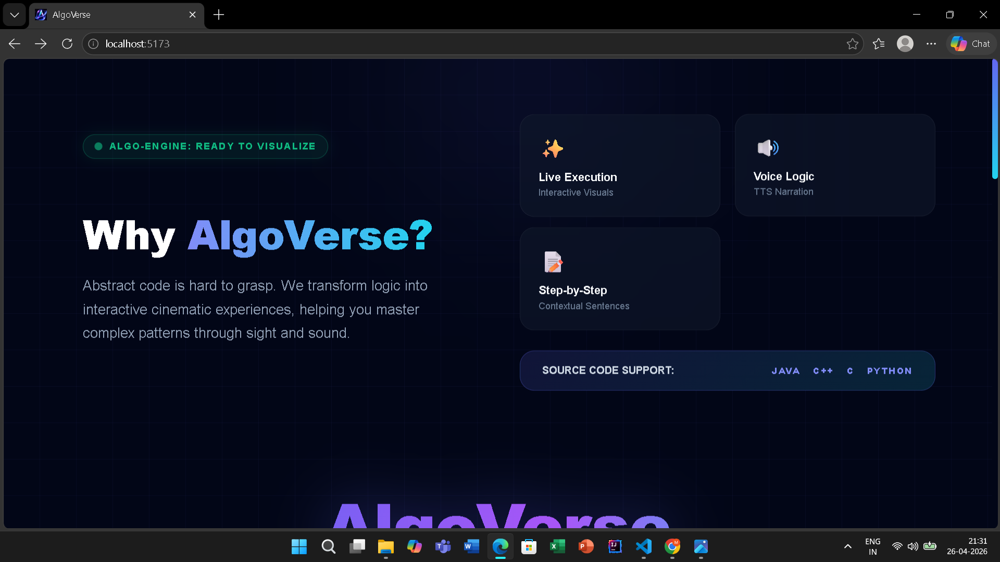
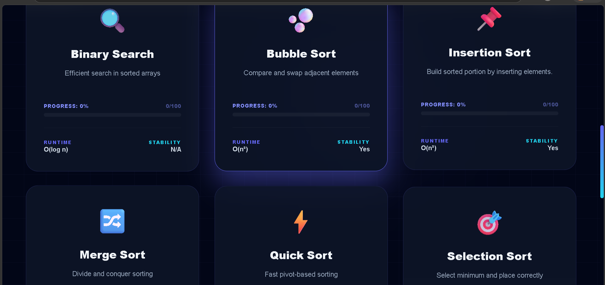
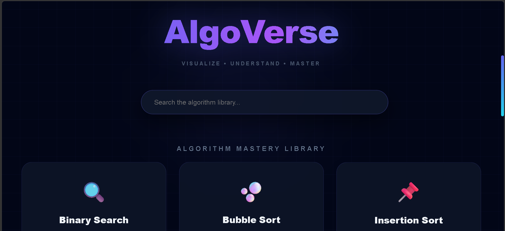
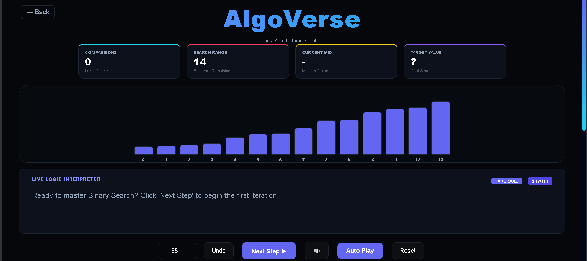
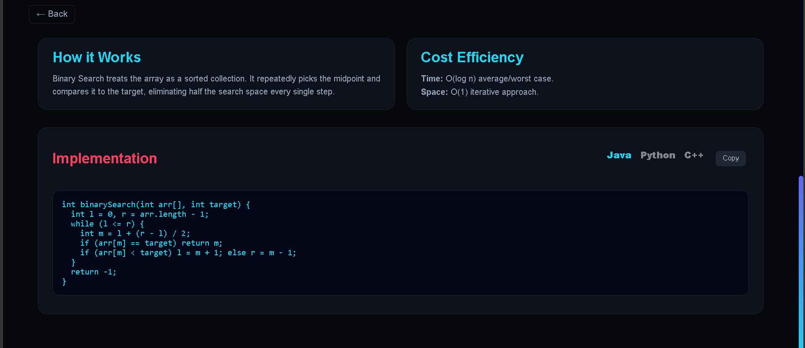
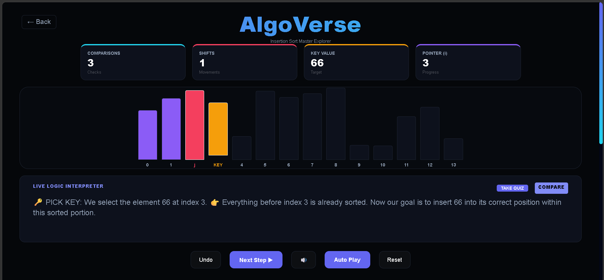

# AlgoVerse 🚀

## 🌐 Live Demo

👉 https://algoverse-lab.vercel.app


AlgoVerse is an interactive algorithm visualization platform designed to provide clear, step-by-step execution insights for core data structures and algorithms.

---

## 🌐 Overview

AlgoVerse helps learners understand algorithms through visual, real-time execution. Instead of just reading code, users can observe how algorithms behave step-by-step.

---

## ✨ Features

* 📊 Step-by-step algorithm visualization
* 🎯 Clean and intuitive user interface
* ⚡ Real-time execution flow
* 🧠 Covers core algorithms:

  * Sorting (Bubble, Selection, Insertion, Merge, Quick)
  * Searching (Binary Search)
  * Two Pointers technique

---

## 📸 Preview










---

## 🛠️ Tech Stack

* React.js
* Vite
* JavaScript (ES6+)
* Tailwind CSS

---

## 🚀 Getting Started

```bash
git clone https://github.com/rohan-gaddam/AlgoVerse.git
cd AlgoVerse
npm install
npm run dev
```

---

## 📂 Project Structure

```
src/
 ├── App.jsx
 ├── Home.jsx
 ├── BinarySearchMasterclass.jsx
 ├── BubbleSortMasterclass.jsx
 ├── InsertionSortMasterclass.jsx
 ├── MergeSortMasterclass.jsx
 ├── QuickSortMasterclass.jsx
 ├── SelectionSortMasterclass.jsx
 ├── TwoPointersMasterclass.jsx
 └── styles & assets
```

---

## 🎯 Vision

To simplify complex algorithmic concepts through visual and interactive learning experiences.

---

## 🤝 Contributing

Contributions are welcome. Feel free to open issues or submit pull requests.

---

## 📄 License

This project is licensed under the MIT License.
